# JobConnect App

A web application that connects ordinary people with skilled professionals. Built with a microservices architecture and containerized using Docker, the app brings together various services to handle job management, real-time chat, image handling, and secure user authentication.

## Table of Contents

- [Overview](#overview)
- [Features](#features)
- [Architecture](#architecture)
- [Technologies](#technologies)
- [Getting Started](#getting-started)
- [Usage](#usage)
- [Contributing](#contributing)
- [License](#license)

## Overview

Job Connect App is designed to facilitate connections between customers who need jobs done and companies offering professional services. Customers can create job requests using a basic or advanced form, and companies can browse, search, and assign jobs to themselves. The platform also integrates a real-time chat system to enable direct communication between the two parties.

All user data is managed securely using Keycloak, and communication between services is protected via refresh/access tokens with bearer authentication.

## Features

### For Customers

- **Job Creation**  
  - **Basic Form:** Enter a title, select a category, and provide a description.  
  - **Advanced Form:** In addition to the basic fields, select a subcategory (filtered based on the selected category), upload images, and specify a budget.
  - **Smart Category/Subcategory Selection:**  
    - When selecting a category, the available subcategories are limited to the conjunction of the chosen categories, ensuring that only the most relevant options are displayed.  
    - Customers can search for categories and subcategories directly. As the user types, if the entered category or subcategory does not exist, an **"Add"** button appears, allowing them to add their search term to their personal category/subcategory list.
- **My Jobs Tab:**  
  - View a list of created job requests.
  - Click the **Detail** button to see all job information, including images and access a real-time chat with the assigned company.

### For Companies

- **Job Browsing and Assignment**  
  - **All Jobs Tab:**  
    - View all available jobs that are not yet assigned.
    - Use a search feature to filter jobs based on title, description, category, or subcategory.
  - **Job Details:**  
    - Click the **Detail** button to view job details (excluding chat).
    - Use the **Assign** button to take on a job.
- **My Jobs Tab:**  
  - After assignment, view detailed job information and engage in real-time chat with the customer.

### Security and Logging

- **User Management:**  
  - Securely manage users with Keycloak.
- **Token-Based Authentication:**  
  - Communication is protected using refresh/access tokens. The frontend sends bearer tokens to the backend.
- **Endpoint Protection:**  
  - Access is controlled based on user roles, ensuring endpoints are protected against unauthorized access.
- **Logging Middleware:**  
  - All requests and responses are logged for traceability and debugging.

## Architecture

The application is composed of several microservices and containerized components:

- **job-control:** Handles job creation, retrieval, and management.
- **frontend:** The user interface built with Vue and Vuetify.
- **images:** Manages image uploads and storage.
- **chat:** Provides real-time chat functionality between customers and companies.

Additional containers include:

- **MongoDB:** NoSQL database for storing job and user-related data.
- **Keycloak:** Identity and access management service for secure user authentication.

## Technologies

- **Vue.js & Vuetify:** Frontend framework and UI library for a responsive and user-friendly interface.
- **Docker:** Containerization of the microservices for consistent deployment.
- **MongoDB:** NoSQL database for data storage.
- **Keycloak:** For secure user management and authentication.

## Getting Started

### Prerequisites

- [Docker](https://www.docker.com/get-started) installed on your system.
- [Docker Compose](https://docs.docker.com/compose/) for orchestration.
- [Compass](https://www.mongodb.com/try/download/compass) for MongoDB.

### Installation

1. **Clone the Repository**

    ```bash
    git clone https://github.com/jirisuster/jobconnect.git
    cd jobconnect
    ```

2. **Build and Run the Application**

    If you're using Docker Compose, run:

    ```bash
    docker-compose up --build
    ```
3. **Import Keycloak Realm**

    Open your browser and navigate to:

    ```
    http://localhost:8091
    ```
    login with default cerditinals username: ```admin```, password: ```1234```.\
    Click on **create new realm**\
    Import realm from ```import\KeyCloak\realm-export-docker.json```.\
    Create users, and assign them roles (customer/company)

4. **Import Example Categories**

    Open compass and connect to ```localhost:27018```\
    in ```category```, import ```import\MongoDB\jobs_app.category.json```\
    in ```subcategory```, import ```import\MongoDB\jobs_app.subcategory.json```

5. **Access the Application**

    Open your browser and navigate to:

    ```
    http://localhost:5002
    ```

## Usage

- **For Customers:**
  - Navigate to the **Add Job** tab.
  - Choose between the basic or advanced job creation form.
  - When selecting categories, notice that the subcategories are dynamically filtered based on your choice, presenting only the most relevant options. You can also search for a category or subcategory directly. If your search does not match an existing entry, an **"Add"** button will appear to let you add your own.
  - View your created jobs in the **My Jobs** tab. Click **Detail** to see the full job information, including images and the real-time chat with the assigned company.

- **For Companies:**
  - Browse available jobs in the **All Jobs** tab.
  - Use the search functionality to filter jobs by title, description, category, or subcategory.
  - Click **Detail** to view job information (chat is not available here) and assign the job using the **Assign** button.
  - Once assigned, the job will appear in the **My Jobs** tab where you can view details and engage in chat with the customer.


## Screenshots
### Customer

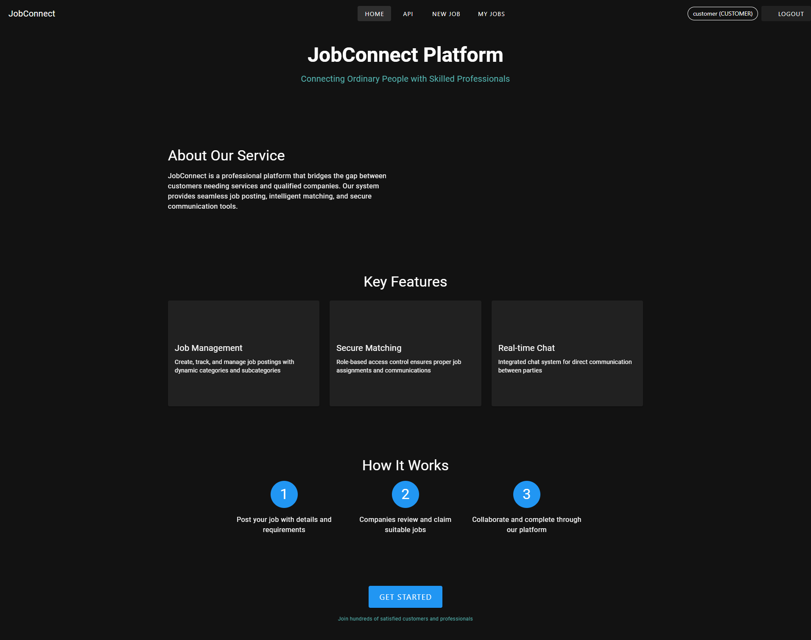
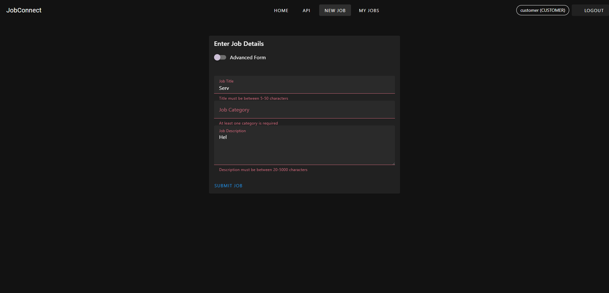
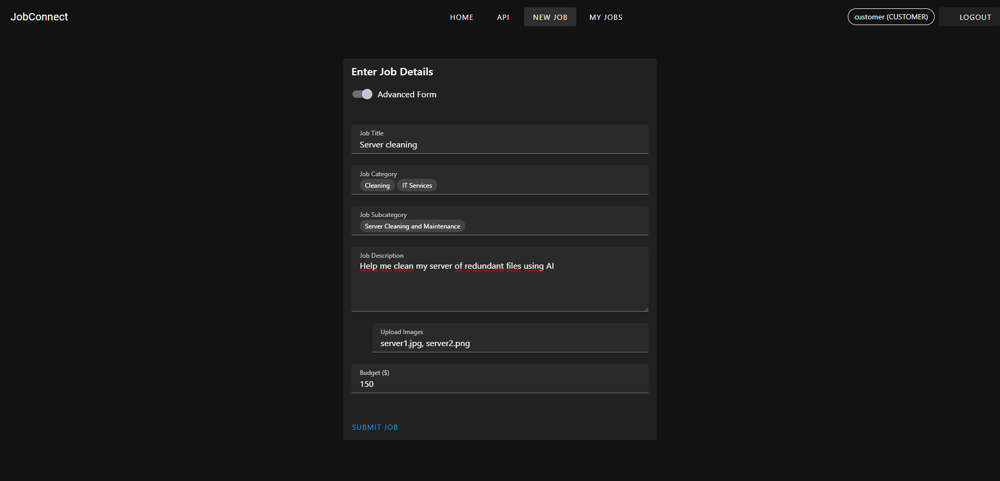
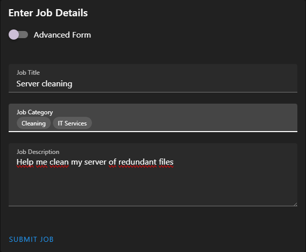
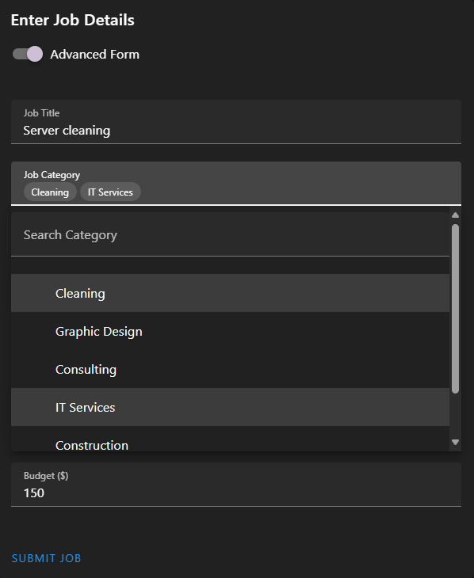
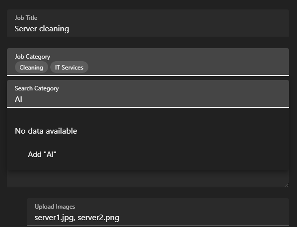
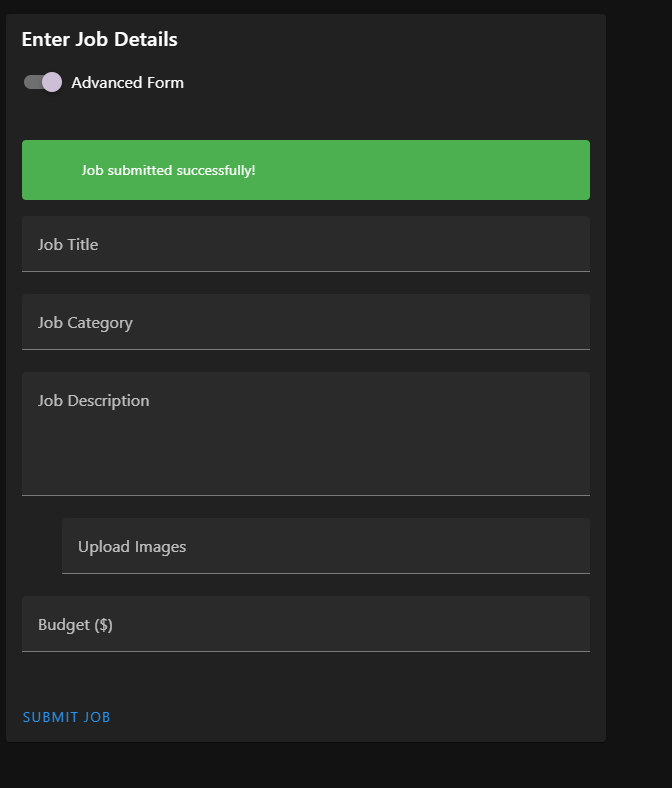
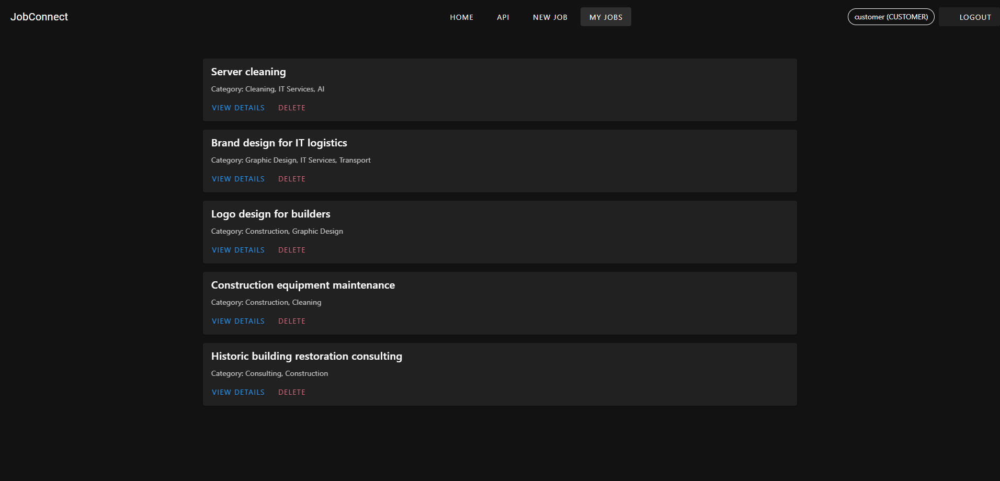
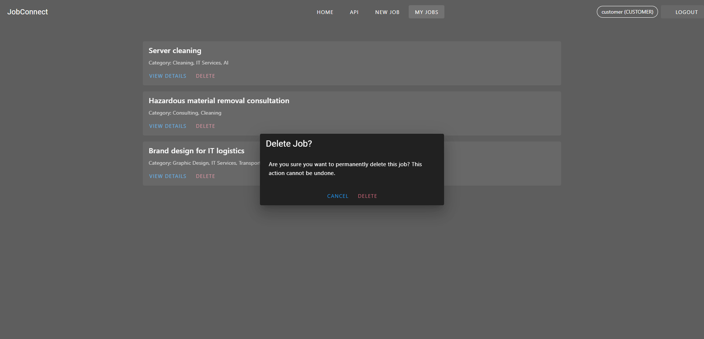

### Company

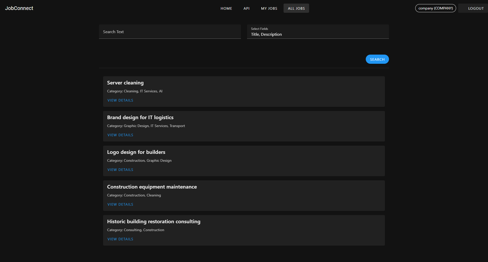
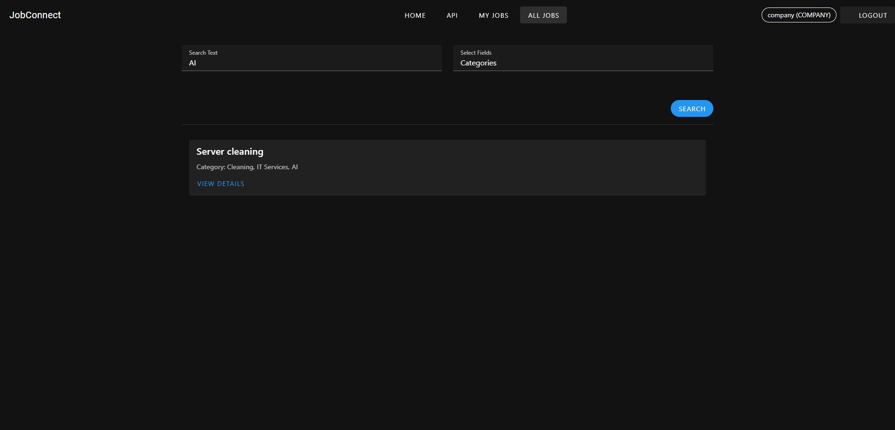
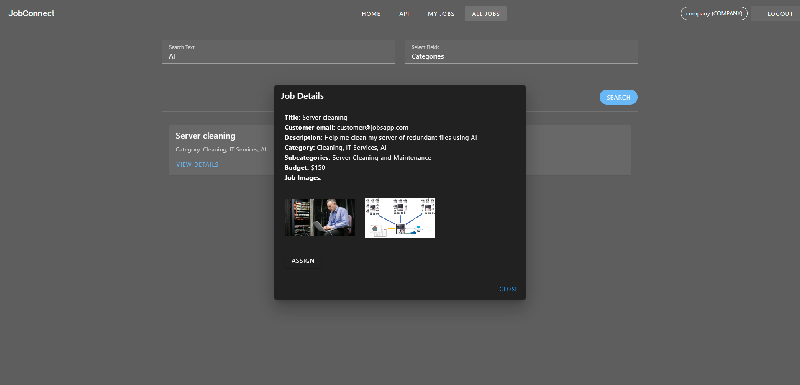


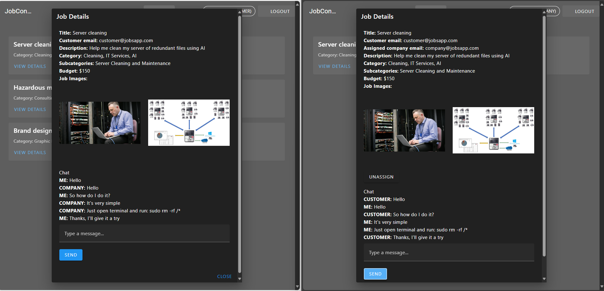

## License

[MIT](https://choosealicense.com/licenses/mit/)

